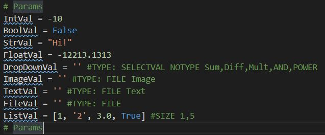
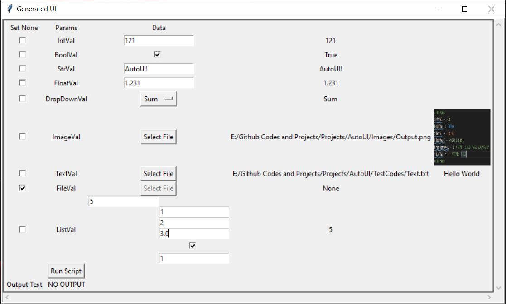

# AutoUI
 Automatic UI Generator for Various Languages and in Various UI Libraries

## Python Code --> TKinter UI
   - Generates Tkinter UI for Python Scripts written in specific form (customisable)
   - Inputs and Parameters to the Script can be changed in Interactive UI and script can be executed using these inputs
   
   Parameters in Script
   
   
   
   Generated UI
   
   
